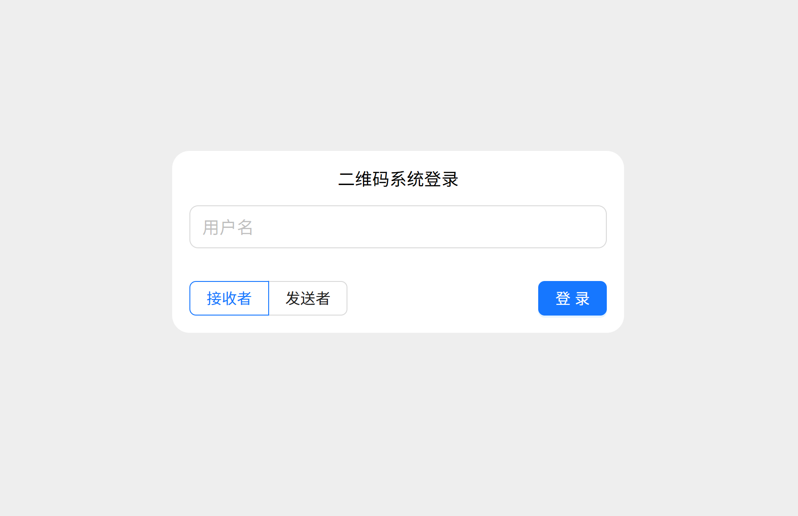
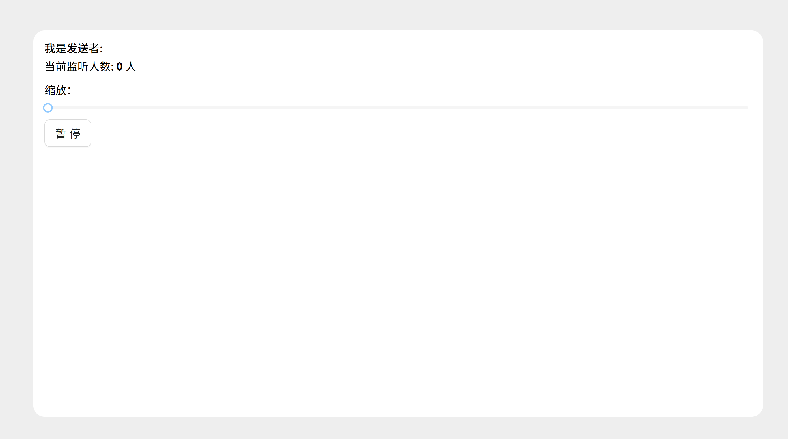

# 二维码分享器

你是否在头疼雨课堂动态二维码签到？此项目旨在帮助用户快速生成并分享二维码图片，一人扫码，全宿舍签到。
技术栈：Vue 3 + Vite +Ant Design Vue + Socket.IO

# 使用

1. 选择角色（二维码发送者/接收者），输入用户名登录，没有密码，用户名只是为了区分不同用户。
2. 发送者每次扫码后，二维码会自动发送给接收者，接收者会实时收到最新的二维码。
3. 接收者会看到一个发送者列表，选择要监听的发送者，进入它的房间，等待发送者发送二维码。

> 并不会传输二维码图片，而是传输二维码解码后的URL，接收者通过URL重新生成二维码图片，这样可以有效节省流量。

# 页面预览

# 开发环境测试

项目采用vite构建，在vite.config.ts中配置了后端接口地址和https证书路径，供开发环境与后端联合调试。